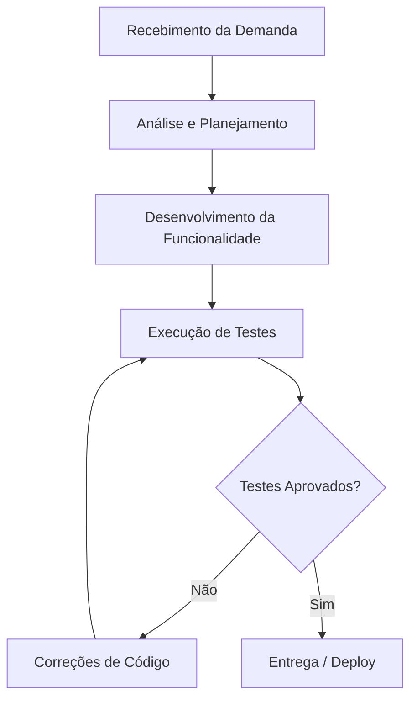

# Aula 14 - Qualidade de Processo

## 👥 Integrantes

- Felipe Teles

## 1. Mapeamento do Processo




### Fluxo Atual da Equipe

```text
Recebimento da Demanda
          ↓
   Desenvolvimento
          ↓
      Testes
          ↓
     Correções
          ↓
       Entrega
```

## 2. Entradas, Atividades e Saídas

| Etapa | Entrada | Atividade | Saída |
| :--- | :--- | :--- | :--- |
| **Recebimento da demanda** | Requisito de negócio ou feedback de usuário | Refinamento da regra de negócio e divisão em subtarefas no Trello | Card da tarefa detalhado com Critérios de Aceite (Definition of Ready) |
| **Desenvolvimento** | Card detalhado e aprovado | Codificação da funcionalidade (React, Node.js, Prisma) | Branch de feature isolada com Pull Request (PR) aberto no GitHub |
| **Testes** | Pull Request aberto no repositório | Validação de regras de negócio via testes automatizados e code review | Relatório de execução dos testes e apontamentos de melhoria |
| **Correções** | Apontamentos do code review e bugs dos testes | Refatoração de código, ajuste de lógica e otimização de performance | Novos commits na branch garantindo a resolução das falhas |
| **Entrega** | Pull Request com aprovação final | Integração (Merge) na branch principal e Deploy na plataforma (Vercel) | Funcionalidade validada e disponível em ambiente de produção |

## 3. Reflexão sobre o Processo

### 1. O processo utilizado pela equipe está claramente definido?
Ate que sim, a gente sabe os passos principais (planejar, codar, testar e entregar), mas nem tudo e documentado direito, entao as vezes da duvida se a tarefa realmente acabou.

### 2. Todos os integrantes seguem o mesmo fluxo de trabalho?
Na maior parte do tempo sim. Mas quando o prazo ta apertado a gente acaba pulando o planejamento mais detalhado e vai direto pro codigo pra dar tempo.

### 3. Em quais etapas a qualidade é verificada?
Mais na parte de testes mesmo, depois que o desenvolvimento acaba, e tbm quando um colega revisa o codigo do outro antes de subir.

### 4. Quais melhorias poderiam tornar o processo mais eficiente?
- Criar um checklist padrao antes de fechar a tarefa
- Automatizar mais os testes pra nao depender tanto da gente testar na mao
- Melhorar a divisao das tarefas la no Trello

### 5. Como a qualidade do processo impacta a qualidade do produto final?
Um processo organizado ajuda a diminuir os erros e o retrabalho. Se a gente organiza direito o fluxo de trabalho, o sistema final sai com menos bugs e fica muito mais estavel pro usuario.